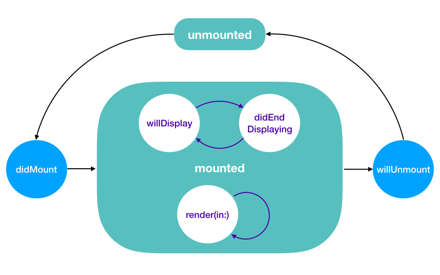

# Bento Component Contract
## Terminology
Name | Definition
--- | ---
Component | <p>A _component_ is a declarative configuration, constrained by the  `Renderable` protocol, that can be repeatedly rendered into its designated native view. A component type can only be associated with one native view type.</p>
Composite | <p>A _composite_ (or _composite component_) combines zero or more child components with its layout semantics.</p><p>Unlike a _decorator_, a composite generally defines its own native view type, so as to manage the views of its child components.
Decorator | <p>A _decorator_ (or _decorating component_) performs additional side effects while funnelling `Renderable` calls to its wrapped component.</p><p>A decorator does not define its own native view type — it works with the view type of the wrapped component with restrictions.</p> 

## Components 
### Components must conform to `Renderable`.
`Renderable` represents a set of requirements which a component must satisfy for Bento to integrate it.

### The set of operations on the view hierarchy must be consistent across all conditional branches.
To ensure correct view reuse behavior, if a component conditionally mutates a key path or invoke a method, it must perform the same operation with a sensible value in all other branches-not-taken. 

For example:
<table><tr><th>Incorrect</th><th>Correct</th></tr><tr><td>

```swift
extension ExampleComponent: Renderable {

let isBlue: Bool

func render(in view: ExampleView) {
    if isBlue {
        view.backgroundColor = .blue
    }
    // ❌: The else-branch does not set `\.backgroundColor`.
    //     This would lead to indeterminstic view reuse behavior.
}
```
</td><td>

```swift
extension ExampleComponent: Renderable {
    let isBlue: Bool

    func render(in view: ExampleView) {
        view.backgroundColor = isBlue ? .blue .white
        // ✅: Both branches set `\.backgroundColor`.
    }
}
```
</code></td></tr></table>

Alternatively, a component may rely on any snapshot-apply mechanism, e.g. `Bento.StyleSheet`, which provides a mean to undo application, returning the view to its prior state.

```swift
extension ExampleComponent: Renderable {
    let isBlue: Bool

    func didMount(to view: ExampleView, storage: ViewStorage) {
        var styleSheet = StyleSheet<ExampleView>()
        
        if isBlue {
            styleSheet.set(\.backgroundColor, .blue)
        }
    
        storage[snapshotForReversionKey] = styleSheet.apply(to: view) 
    }
    
    func willUnmount(from view: ExampleView, storage: ViewStorage) {
        // ✅: The snapshot reverts `\.backgroundColor` to whatever
        //     value it was prior to the application in `didMount(to:storage:)`.
        storage[snapshotForReversionKey]?.apply(to: view)
    }
}

private let snapshotForReversionKey = ViewStorage.Key<StyleSheet<ExampleView>>()
```

### Any given ID path may be rendered with any component type at any time.
Bento is designed to be very flexible in terms of component types. Users should require no extra precaution in populating their `Box`es with different permutations of ID paths and components.

### Visible ID paths may be repeatedly re-rendered.
Bento may repeatedly re-render all visible ID paths with a new component at the same ID path, for example, when a new `Box` is applied. In other words, `render(in:)` should be kept as performant as possible, and has no implication of view appearance.

In general, setting variables in `render(in:)` is fairly efficient. However, if there are heavy computations that become a performance bottleneck, consider moving them to the view, and taking advantage of the UIKit constraint layout pass to coalesce changes.

### Components must not offer callbacks with direct access to any part of the view hierarchy.
Component callbacks, that vends any point of the view hierarchy to the user directly, would imply changes being irreversable and undiscoverable. This has serious implications when the view would be recycled by the container, where those changes may be carried to the next bound component unintendedly, and in turn lead to indeterministic results.
 
Provide a declarative API by asking for information covering all supported scenarios. Use the collected data to manipulate the view hierarchy accordingly, and make sure all branched scenarios would erase the trails of each other properly.

## Composites
### Composites must manage the component lifecycle of its children.
It is the responsibility of any composite to message its children about changes in their lifecycle. Failing to do so might result in unexpected behaviors, since components may have varying behaviors depending on the lifecycle change.

## Decorators
### Decorators must funnel all `Renderable` calls to its wrapped component.

### Decorators must respect the wrapping order.
When funnelling `Renderable` calls, decorators must perform its side effects after calling its wrapped component.

### Decorators must reset the view hierarchy to the pre-bound state.
To ensure correct view reuse behavior, when the component unmounts, any change to the view hierarchy by decorators must be undone. For example, if a behavior sets an accessibility identifier to a view when the component mounts, it must reset the accessibility identifier to the value prior to the mutation. 

Bento provides the `didMount(to:viewStorage:)` and `willUnmount(from:viewStorage:)` lifecycle calls, designed for decorators to satisfy the requirement efficiently.

## Recommendations
### `Equatable` conformance of any component is unnecessary.
Bento enforces no restriction in what types of properties the component can comprise of. Moreover, there are also prevalent uses of non-equatable properties, for example, user interaction callbacks. Therefore, Bento does not require any component to be evaluable for equation.

### Components should not rely on rendering occurences as the sole trigger of animations.
[Given that re-rendering has no implication of view appearance](#visible-id-paths-may-be-repeatedly-re-rendered), rendering occurences — as in `render(in:)` invocations — are meant for data propagation. Components should trigger animations based on actual observed changes in data, or visibility hooks like `ViewLifecycleAware`.

## Component Lifecycle

